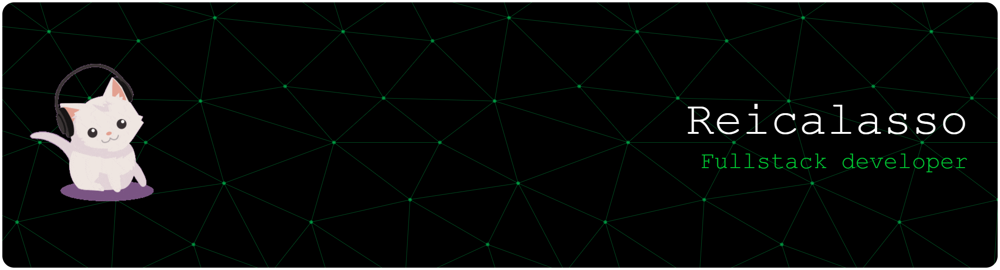

  <!-- Banner -->
  

    

  <!-- Avatar -->
  

  <h1>Hey, I'm Arda — a.k.a. <strong>REI CALASSO</strong></h1>
  
<em>Software Engineering Student · Full-Stack & Systems Dev · Embedded & AI tinkerer</em>

  

    
    
    
  

  

    
    
    
  

---

## ✦ Snapshot
- ᝰ Software Engineering student building tangible systems that ship to real hardware.  
- ⚙️ Strong interests: distributed systems, high-performance backends, embedded cyber-physical builds, and applied ML.  
- 🧱 Currently iterating on self-healing file sync engines, real-time telemetry dashboards, and neural inference on the edge.  
- 🤝 Open to internships, junior SWE roles, and collaborations on ambitious R&D projects.  
- 🔭 Side quests: AR tooling, ML compilers, and experimentation with Rust + C++ interoperability.

---

## 🚀 Spotlight Projects
<table>
  <tr>
    <td width="100%">
      <h3>SentinelFS-Neo · Distributed Sync</h3>
      
Autonomous peer-to-peer file synchronization engine with delta-sync, topology remeshing, and anomaly-detection hooks.

      <ul>
        <li>Predictive chunking keeps transfers minimal.</li>
        <li>ONNX Runtime inference guards against tampering.</li>
        <li>CLI + daemon combo for both servers and maker boards.</li>
      </ul>
      
<strong>Stack:</strong> C++17, threads, filesystem events, ONNX Runtime

      
<a href="https://github.com/reicalasso/SentinelFS">View Repo ↗</a>

    </td>
  </tr>
</table>

---

## 🧠 Currently Exploring
- 📡 Low-latency messaging layers for distributed telemetry.  
- 🔐 ESP32-powered cybersecurity tooling for wireless audits.  
- 🧮 Quantized neural networks that can run on microcontrollers.  
- 🧊 Rust for systems plus C interoperability patterns.  
- 🕶️ AR overlays that merge embedded sensor streams with browser UIs.

---

## 🔧 Tech Stack
<table>
  <tr>
    <th>Languages</th>
    <td></td>
  </tr>
  <tr>
    <th>Back-end & Data</th>
    <td></td>
  </tr>
  <tr>
    <th>Web & UI</th>
    <td></td>
  </tr>
  <tr>
    <th>ML / Systems</th>
    <td></td>
  </tr>
  <tr>
    <th>DevOps & Tooling</th>
    <td></td>
  </tr>
  <tr>
    <th>Embedded</th>
    <td></td>
  </tr>
</table>

---

## 🛰️ Experiments & Mini Builds
- 
  **MakerBoard Ops Suite** — ESP32 projects geared toward wireless security audits, custom RF tooling, and OTA dashboards.  
- 
  **HyperFocus Todo (React)** — Offline-first task manager with optimistic UI + IndexedDB sync.  
- 
  **Weather Pulse** — Data viz heavy weather app layering REST + WebSocket feeds.  
- 
  **AuthN Starter** — FastAPI + JWT boilerplate with tiered RBAC and refresh rotation.

---

## 🗓️ Flow & Learning Timeline
- **2025** · Iterating on SentinelFS-Neo auto-remesh strategies + AR telemetry overlays.  
- **2024** · Built MindLine MVP, shipped multiple ESP32 cyber prototypes, and pushed deeper into Rust.  
- **2023** · Crafted foundations in full-stack web, backend auth services, and ML fundamentals.

---

## 📊 Metrics & Activity

  

  

  

---

## 📫 Connect With Me

  
  
  
  

---

  <strong>⭐ If any of this resonates, feel free to star a repo or reach out!</strong>

