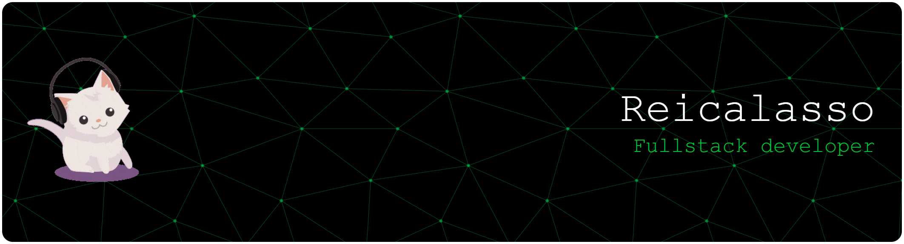

  

   

  <h1>Mehmet Arda Hakbilen <strong>(Kael Valen)</strong></h1>
  
<em>Software Engineer · ML Systems & Efficient Architectures · Student</em>

   

  

    
    
    
  

   

  

    
    
  

---

## What I'm Working On

I'm interested in the intersection of **model architecture** and **inference efficiency** — specifically, why modern sequence models are designed the way they are, where they fail, and whether simpler alternatives can close the gap.

Right now I'm building [**PULSE**](https://github.com/kaelvalen/beyond_transformer) — an experimental O(n) architecture that replaces the standard SSM + Attention + State stack with a single uniform block. It's not finished. It's a research project where I'm learning by building from scratch.

**Current focus areas:**
- Linear attention and its approximation trade-offs
- Kernel-based sequence models vs. softmax attention
- Hardware-aware algorithm design (memory hierarchy, tiling, compute efficiency)
- Why Flash Attention works at the kernel level — working through the math

---

## Projects

### [PULSE — Parallel Unified Linear State Engine](https://github.com/kaelvalen/beyond_transformer)
`PyTorch` `Python` `Research`

An experimental sequence architecture exploring whether a single O(n) primitive (local convolution + linear attention + gated fusion) can replace the complexity of transformer-style stacks. Active development — see the repo for current status and known issues.

---

### [SentinelFS](https://github.com/kaelvalen/SentinelFS)
`C++17` `P2P` `Distributed Systems` · **Archived**

Distributed peer-to-peer file sync with ML-based anomaly detection, delta-sync algorithms, and self-healing network topology. No longer maintained — kept for reference.

---

## Tech Stack

<table>
  <tr>
    <td><strong>ML / Research</strong></td>
    <td>
      
      
      
      
    </td>
  </tr>
  <tr>
    <td><strong>Languages</strong></td>
    <td>
      
      
      
      
    </td>
  </tr>
  <tr>
    <td><strong>Web</strong></td>
    <td>
      
      
      
    </td>
  </tr>
  <tr>
    <td><strong>Infra</strong></td>
    <td>
      
      
      
    </td>
  </tr>
</table>

---

## GitHub Activity

  
    
  

---

  Open to research collaboration, architecture discussions, and code review. Not interested in wrapper apps or hype-driven projects.

